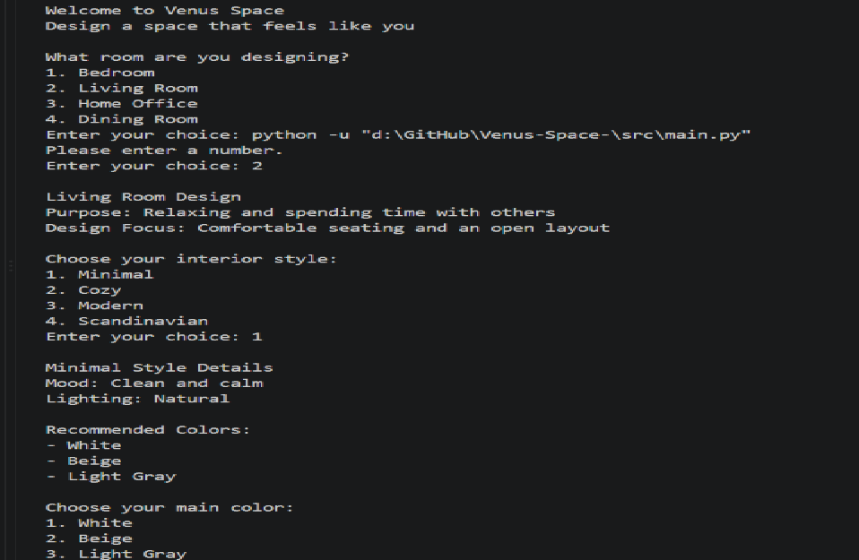
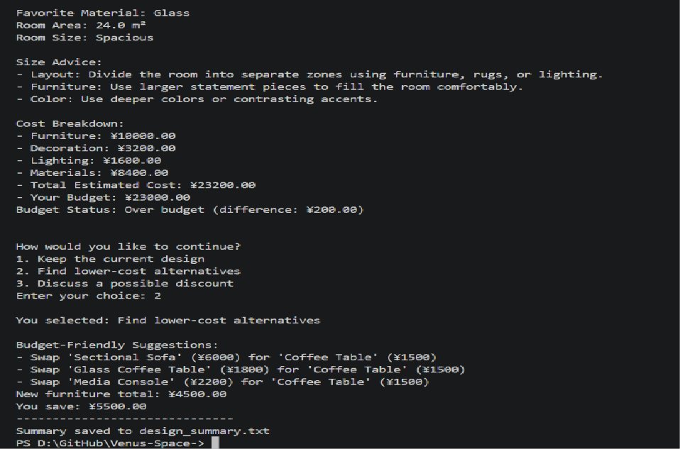
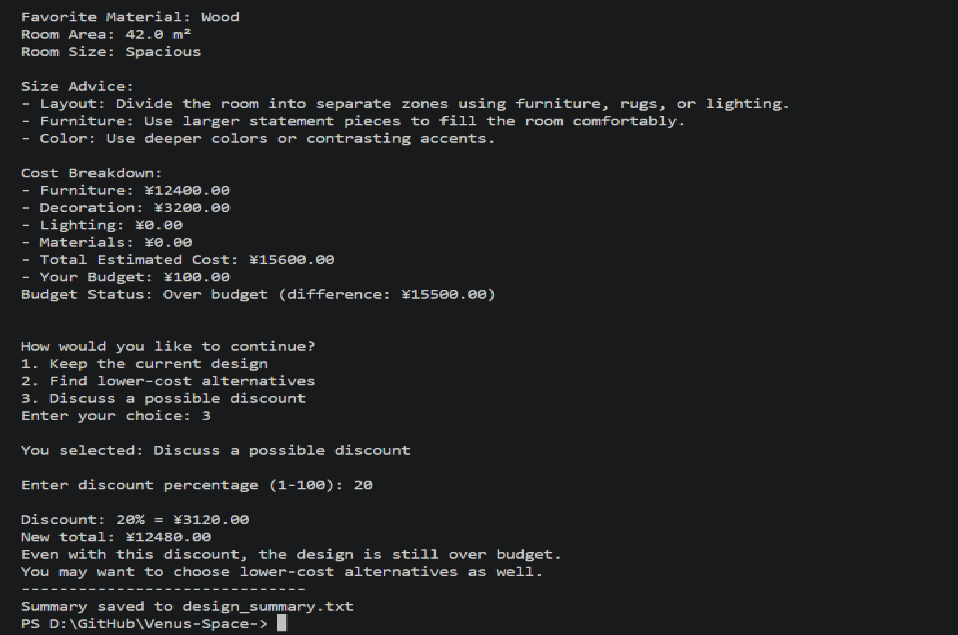

# Venus Space 🏠

A command-line interior design assistant written in pure Python.
Venus Space helps clients design a room by recommending styles, colors,
materials, and furniture — then estimates the total cost and compares
it against the client's budget.

## Features

- Choose from 4 rooms: Bedroom, Living Room, Home Office, Dining Room
- Choose from 4 interior styles: Minimal, Cozy, Modern, Scandinavian
- Style-based color and material recommendations
- Room size classification (Compact / Medium / Spacious) with layout advice
- Cost estimation: furniture, decoration, lighting, and materials (per m²)
- Budget comparison with difference amount
- Over-budget options: keep design, find cheaper alternatives, or apply a discount
- Saves a design summary to a text file (`design_summary.txt`)

## Screenshots

## How to Run

1. Make sure Python 3 is installed.
2. Clone this repository:

   git clone [your-repo-url]

3. Navigate to the project folder and run:

   cd Venus-Space-/src
   python main.py

## Project Structure

    src/
    ├── main.py          # program flow
    ├── helpers.py       # input validation helpers
    ├── styles.py        # interior styles data
    ├── data.py          # rooms, recommendations, budget options
    ├── furniture.py     # furniture prices by room
    ├── decorations.py   # decoration prices
    ├── design_costs.py  # lighting and material prices
    └── reports.py       # saves summary to file

## Technologies

- Python 3 (standard library only — no external packages)

## Author

[Your name] — Computer Science and Technology, NJUPT

## Version

v1.0